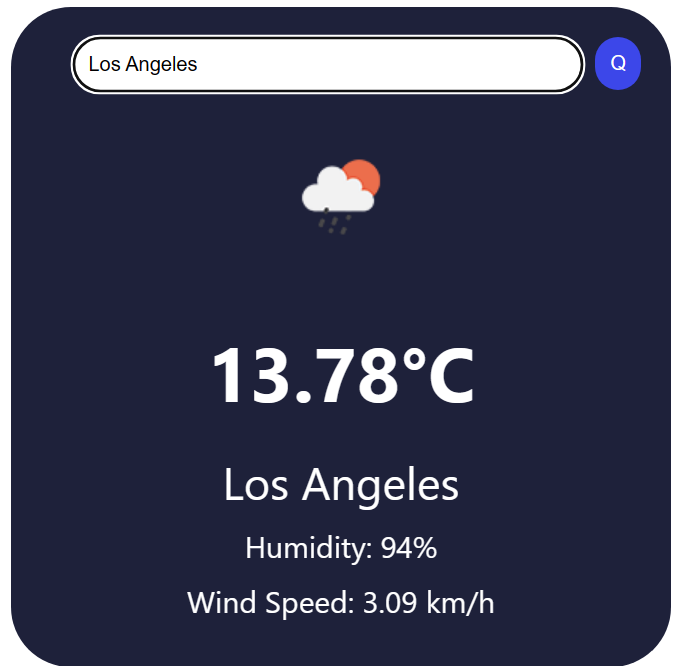

# Weather App

This weather app is a simple React application that allows users to search for current weather conditions using the OpenWeatherMap API.

## Features

- Search for weather by city
- Displays temperature, humidity, and wind speed
- Responsive design

## Technologies Used

- React
- OpenWeatherMap API
- HTML/CSS/JS
- Python Language

## Example Run

Here is how the weather app looks when you search for the weather in Los Angeles:



## How to Run

To run this project locally, follow these steps:

1. Clone the repository to your local machine.
2. Navigate to the directory of the cloned repository.
3. Install the dependencies by running:

```bash
npm install

4. After the installation is complete, you can start the app by running:

'''bash
npm start
